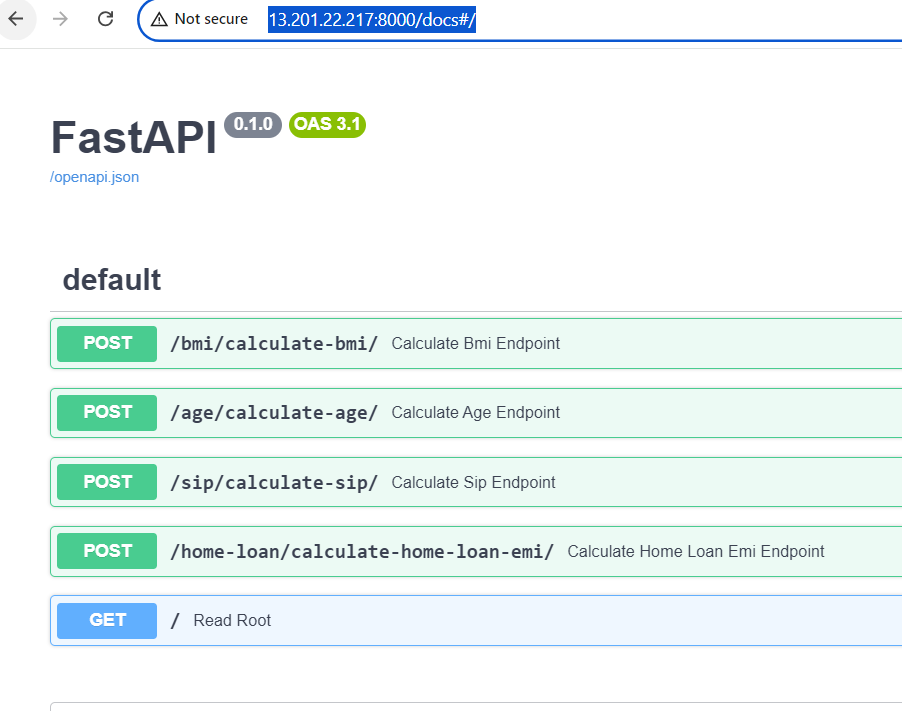

# FastApi-Projects

# Install - For Amazon Linux 2
sudo yum update -y    
sudo yum install python3-pip -y  
sudo yum install git -y
pip install fastapi uvicorn

# Running

1.  git clone https://github.com/alexvatti/FastApi-Projects.git
2.  cd FastApi-Projects
3.  cd sample
4.  uvicorn main:app --host 0.0.0.0 --port 8000

# App Testing
-  <Public IP>:8000/docs#/

## Example
http://13.201.22.217:8000/docs#/

